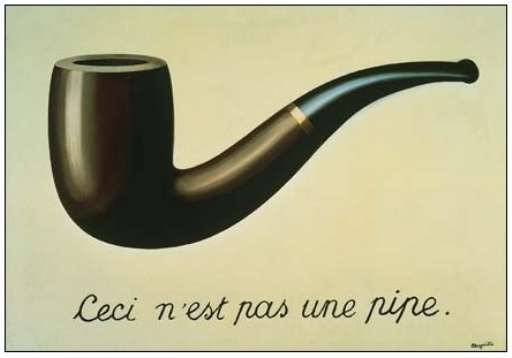
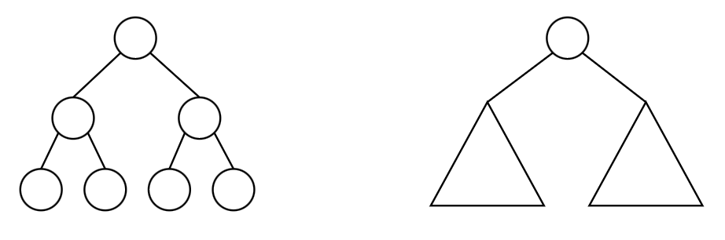

# Rappresentazione di Oggetti

  

*“separare scrupolosamente, crudelmente, l’elemento grafico dall’elemento plastico: se ad essi accade di trovarsi sovrapposti all’interno del quadro, come una didascalia e la sua immagine, è a condizione che l’enunciato contesti l’identità esplicita della figura e il nome che si è pronti a darle”.   - René Magritte (1898-1967)*  
  
Un concetto chiave quando si parla di formalismi matematici e linguaggi di programmazione è la differenziazione tra l'oggetto che si vuole rappresentare e la rappresentazione dello stesso.  
Cosa vedete in questo quadro? Se avete risposto una pipa avete sbagliato, questa è la rappresentazione di una pipa.  
Può sembrare controintuitivo ma nel momento in cui vi chiedo di fumare quella pipa vi rendete conto che a meno che non vogliate arrotolare il dipinto e infiammarne un'estremità non sia possibile.  
Anche volendo, la vera pipa che il quadro raffigura non può essere arrotolata, quindi la rappresentazione ha delle proprietà aliene all'ogetto rappresentato.  

Allo stesso modo quando in un linguaggio come C rappresentiamo un albero binario di ricerca dobbiamo tenere a mente che quella *cosa* non è davvero un albero perchè maneggiando i puntatori potremmo compiere operazioni che un BST non ammetterebbe.  

Quindi onde evitare di arrotolare un albero binario nel malaccorto tentativo di rappresentarlo, gli informatici hanno creato dei formalismi matematici che cercano di ridurre al minimo queste eventualità.  

## Oggetti in haskell
La potenza di un linguaggio funzionale come haskell è quella di rappresentare \\(\lambda\\)-termini e funzioni matematiche, il che, a fronte di un paradigma meno intuitivo a chi è abituato alle macchine di turing, riduce notevolmente il rischio di errori e aumenta l'espressività del codice.  
  
> **Reminder su Pattern matching**  
> In haskell possiamo definire la funzione che somma tutti gli elementi di una lista come  
> ```haskell
> somma l = if(null l) then 0 else (head l) + (somma (tail l))
> ```
> oppure possiamo rappresentarla tramite *pattern matching*:  
> ```haskell
> somma [] = 0
> somma [n:ns] = n + somma ns
> ```
> In questo caso stiamo sfruttando il pattern ```n:ns``` che ci aiuta a generalizzare una lista in termini di primo elemento \\(n\\) contatenata (\\(:\\)) al resto della lista \\(ns\\). 
>  
> Separiamo quindi il caso base in cui la lista corrisponde a una lista vuota [] dal caso generico in cui la lista corrisponde al pattern ```[n:ns]``` .  
> vedremo una definizione formale di pattern matching nel capitolo sintetico sul \\(\lambda\\)-calcolo.  

Immaginiamo un albero binario etichettato. 
Può essere definito formalmente per ricorsione come un nodo con un'etichetta collegato a due alberi binari etichettati.  

  
Allo stesso modo possiamo rappresentarlo in haskell e utilizzarlo tramite pattern matching nel seguente modo  

```haskell
data BTint = EmptyT | MkT Int BTint BTint
```
Con ```MkT``` chiamiamo quello che sarà il costruttore del nostro albero.  
Mentre con ```Empty``` rappresentiamo l'albero vuoto.  
Vediamo un esempio di funzione che prende come argomento questo albero e restituisce la somma delle etichette.  

```haskell
sumT EmptyT = 0
sumT (MkT n bt1 bt2) = n + (sumT bt1) + (sumT bt2)
```
